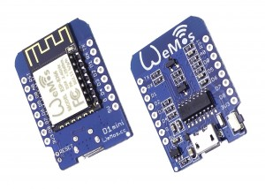

Title: Getting started with the wemos d1 and micropython
Date: 2016-7-27 16:53
Tags: esp8266, micropython
Category: esp8266
Slug:

First thing to do is obtain the wemos d1 mini.



Currently they can be bought from the [wemos store on ali express](http://s.click.aliexpress.com/e/zfeyfIaub) for £3.08 each with free p&p.

I've heard there are fake versions on aliexpress that are cheaper but the link above takes you to the manufacturers store.
They can take 2/3 weeks to arrive and can be bought on ebay if you need them sooner.
They arrive with a little bag of various pins you can use to stack them or plug into a breadboard.

Next up is to get micropython.  
Note that for these instructions I'm using ubuntu. (I'll try to add windows instructions shortly)

Go to [https://micropython.org/download/](https://micropython.org/download/#esp8266).  
Current build at time of writing is esp8266-2016-07-28-v1.8.2-58-g3990b17.bin. 

These are the nightly builds. There are official release builds but I've only seen them distributed to the kickstarter backers.  
These official releases contained some of the other libraries precompiled into the binary such as urequests.

Now we need some way of getting the image onto the d1. For this we will use the esptool.

```python
> pip install esptool
```

Plug one end of the usb into your d1 and the other into your machine.  
ESP tool uses the pySerial library to generate serial data. The D1 uses the CH340 USB to Serial chip which takes our serial data from the usb port and 
pushes it to the serial pins on the d1.

The serial device will show under ```/dev/tty*```. On my laptop it shows as ```/dev/ttyUSB0```

If you're struggling to find it you can tail the kernel log as you plug it in and it should show up (or at least give some helpful information if it doesn't)

```python
> tail -f /var/log/kernel.log
```

You can flash micropython to the device straight away but I found it better to erase whatever contents are their first. 

```python
> esptool.py -p /dev/ttyUSB0 erase_flash
esptool.py v1.1
Connecting...
Erasing flash (this may take a while)...
```

(Running erase_flash a second time takes longer - I don't know why)

Now to flash the d1 with micropython and make it awesome!

```python
> esptool.py -p /dev/ttyUSB0 write_flash -fm dio -fs 32m -ff 40m 0x00000 /path/to/esp8266-2016-07-28-v1.8.2-58-g3990b17.bin
esptool.py v1.1
Connecting...
Running Cesanta flasher stub...
Flash params set to 0x0240
Writing 512000 @ 0x0... 512000 (100 %)
Wrote 512000 bytes at 0x0 in 44.1 seconds (92.8 kbit/s)...
Leaving...
```

There's some discussion around which parameters to use but these work for me.

Press the reset button on the d1 to make sure everything reloads correctly.
We use screen to start a serial connection to the d1. (```sudo apt-get install screen``` if you don't already have it installed). 115200 is the baud rate.

```python
screen /dev/ttyUSB0 115200
```

You will probably have a blank screen, press the Enter key and you will have the python repl prompt, yeehaa!
If you press the reset button on the d1 in your screen session you will see the output of the boot process, a load of junk, then some helpful info and then the repl prompt.

```python
sk(40100368, 3, 3fff62f0, 4)
could not open file 'main.py' for reading

MicroPython v1.8.2-58-g3990b17 on 2016-07-28; ESP module with ESP8266
Type "help()" for more information.
>>> 
```

Don't worry about the main.py warning we'll come to this later.
For now try a couple of python commands. It's python 3 so remember there are some differences if you're used to python 2.7.

```python
>>> print('Yeehaa!')
Yeehaa!
>>> print(1+2)
3
>>> 
```

Interact with the real world and flash an LED

```python
>>> from machine import Pin
>>> p2 = Pin(2, Pin.OUT)
>>> p2.high()
>>> p2.low()
```

The help doc gives good advice on how to use the repl.
Normally you would use it the same as the usual python repl.

```python
>>> help()
Welcome to MicroPython!

For online docs please visit http://docs.micropython.org/en/latest/esp8266/ .
For diagnostic information to include in bug reports execute 'import port_diag'.

Basic WiFi configuration:

import network
sta_if = network.WLAN(network.STA_IF); sta_if.active(True)
sta_if.scan()                             # Scan for available access points
sta_if.connect("<AP_name>", "<password>") # Connect to an AP
sta_if.isconnected()                      # Check for successful connection
# Change name/password of ESP8266's AP:
ap_if = network.WLAN(network.AP_IF)
ap_if.config(essid="<AP_NAME>", authmode=network.AUTH_WPA_WPA2_PSK, password="<password>")

Control commands:
  CTRL-A        -- on a blank line, enter raw REPL mode
  CTRL-B        -- on a blank line, enter normal REPL mode
  CTRL-C        -- interrupt a running program
  CTRL-D        -- on a blank line, do a soft reset of the board
  CTRL-E        -- on a blank line, enter paste mode

For further help on a specific object, type help(obj)
>>> 
```

When copying and pasting code to the repl the indents can end up all over the place so its easier to enter paste mode.
Press Ctrl+E, paste your code and then Ctrl-D to execute.

```python
paste mode; Ctrl-C to cancel, Ctrl-D to finish
=== for i in range(3):
===     print(i)
0
1
2
>>> 
```

On the next post I'll go over the boot process and get it to connect to internet

Go forth and micropython