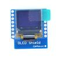
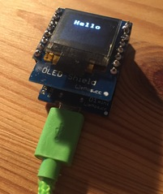
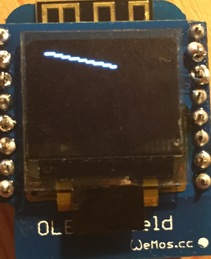
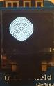
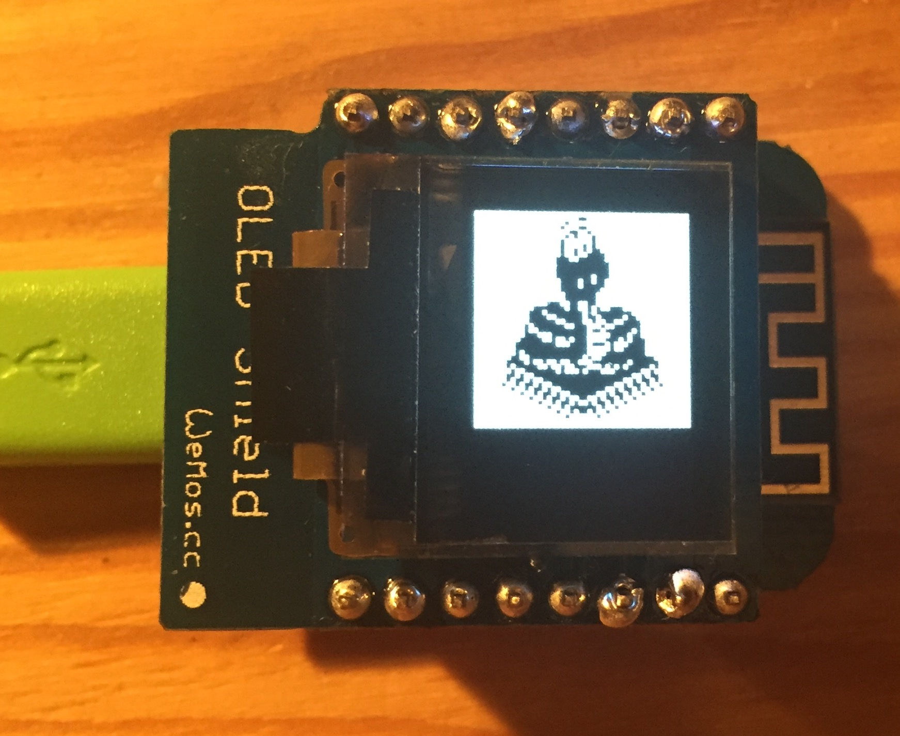

Title: Wemos OLED Shield
Date: 2016-8-2 12:17
Tags: esp8266, micropython, oled
Category: esp8266
Slug: wemos-oled-shield

I was going to write about setting up a server with the D1 but got overexcited about the OLED screen so I'm doing that first.



This is a shield for the Wemos D1 mini and built by the same people. 
It's a 64x48 oled screen that can be mounted on the d1 really easily.
The screen has an I2C interface and driven by a SSD1306 chip which is thankfully supported by micropython.
Full details and schematics can be found [here](http://www.wemos.cc/Products/oled_shield.html).

The screen can be bought from [aliexpress](http://www.aliexpress.com/store/product/OLED-Shield-for-WeMos-D1-mini-0-66-inch-64X48-IIC-I2C/1331105_32627787079.html) for (currently) £3.93 

Once the small package arrives in the post you'll need to get the soldering kit out.

#### First Steps

As a first test, run the following from your screen session.

```python
import ssd1306
from machine import I2C, Pin

i2c = I2C(sda=Pin(4), scl=Pin(5))
display = ssd1306.SSD1306_I2C(64, 48, i2c)
display.fill(0)

display.text('Hello',10,10)
display.show()
```

We first import the library for the driver of the chip along with the I2C and pin libraries.  
The micropython source for the driver can be found at [https://github.com/micropython/micropython/blob/master/drivers/display/ssd1306.py](https://github.com/micropython/micropython/blob/master/drivers/display/ssd1306.py)

[i2c](https://en.wikipedia.org/wiki/I%C2%B2C) is a standard protocol for low speed devices.
It is a two-wire serial protocol which means it has two-wires (obvs) and transmission is serial so a bit is sent on each clock pulse.
If you look on the wemos page for the oled shield you can see it uses 2 pins for the I2C protocol.  
D1 is SCL - Serial Clock Line and D2 for SDA - Serial Data Line.

Now the D1 has a slightly odd non-standard numbering system for its pins so we need to find a mapping [here](https://github.com/esp8266/Arduino/issues/1243).
You can see pin D1 is mapped to pin 5 and pin D2 to pin 4. So we have Pin 4 is SDA and Pin 5 is SDL.

Anywhoos, we can now initialise our i2c object with ```i2c = I2C(sda=Pin(4), scl=Pin(5))```.
There is another parameter for the frequency that defaults to 400k, if we don't pass one in.

A number of devices can exist on the i2c bus, each individually addressed. ```i2c.scan()``` shows the the list of device address' found on the bus.
Running this shows [60]. Checking back to the wemos docs and there is a line 'IIC Address: 0x3C or 0x3D'. 0x3C converted to decimal is 60.
So thats definitely our device we're talking to, woohoo!

Back to the code...
Micropython has a driver for the ssd1306 and we can use it with either i2c or SPI. [SPI](https://en.wikipedia.org/wiki/Serial_Peripheral_Interface_Bus) is another similar protocol to i2c but is quicker and uses more wires.
The [schematics](http://www.wemos.cc/Products/oled_shield.html) for the OLED look like the SPI pins are connected to ground so we probably can't use SPI. 

```display = ssd1306.SSD1306_I2C(64, 48, i2c)```
We create our display object passing in the width (64), height (48) and connection (i2c) parameters (the i2c parameter is labeled as external_vcc?).

Displays generally use a frame buffer. It's sort of like a hidden screen. 
We do all of our draw operations here and then the buffer screen is copied to the physical screen.
(insert nice buffer pic here)
This reduces flicker as we aren't seeing all the different things being drawn just, the final picture.

In the [source](https://github.com/micropython/micropython/blob/master/drivers/display/ssd1306.py) for the ssd1306 you can see that operations are done on the framebuf property of the object

So we first clear the screen with ```fill(0)```, 0 is black so we have an empty black screen.
Then we put some text on the screen ```display.text('Hello',10,10)``` at position 10,10.
Each letter is an 8x8, picture so if we imagine a grid on the screen we can fit 8 characters on 7 rows on the oled.  
This means we can show words like zizzling and flapjack but not jazziness or huzzahing!

Lastly we have ```display.show()```. This copies our buffer screen to the actual screen and then wham there's your greeting!



#### Controls

There are are a couple of functions that don't involve the buffer.

```python
display.invert(invert=1)
```
This flips the white pixels and black pixels. Use ```invert=0``` to get back to the original display.

```python
display.contrast(contrast=155)
```
This effectively sets the brightness of the screen. The docs suggest it goes up to 255 (default). Setting it to 0 isn't that dark, it feels more gray.

```python
display.poweroff()
```
Does what it says on the tin. I don't know how to turn the screen back on though without resetting the device.
There is a poweron() function but it's not populated for the I2C code.


#### Dots and Lines

For drawing pictures that aren't just smileys we need to go to the pixel level :    )

```python
display.fill(0)
display.pixel(x=10, y=20, col=1)
display.show()
```

Now we have a sweet dot on the screen. A couple more and make them move and we'll have quake running on it!
There is a col parameter which (I think) is short for colour. The screen is black and white so we just have 0 or 1 for the colours.

To draw many dots and join them together we need a line function. From [wikipedia](https://en.wikiversity.org/wiki/Bresenham%27s_line_algorithm)

```python
def draw_line(display, x0, y0, x1, y1):
    deltax = x1 - x0
    deltay = y1 - y0
    error = -1.0
    deltaerr = abs(deltay / deltax)  # Assume deltax != 0 (line is not vertical),
        # note that this division needs to be done in a way that preserves the fractional part
    y = y0
    for x in range(int(x0), int(x1)-1):
        # plot(x,y)
        display.pixel(x, y, 1)
        # print(x, y)
        error = error + deltaerr
        if error >= 0.0:
            y = y + 1
            error = error - 1.0
```
Add this to the system with the Ctrl+e method
(Todo: this should be a method of display rather than display passed in as a parameter).

```python
display.fill(0)
draw_line(display,1,2,40,11)
display.show()
```



#### Circles

With a line most shapes can be derived using a series of lines.  
What about circles? Circles are for winners? For sure!  
From [wikipedia](https://en.wikipedia.org/wiki/Midpoint_circle_algorithm)

```python
def draw_circle(display, x0, y0, radius):
    x = radius
    y = 0
    err = 0

    while x >= y:
        display.pixel(x0 + x, y0 + y, 1)
        display.pixel(x0 + y, y0 + x, 1)
        display.pixel(x0 - y, y0 + x, 1)
        display.pixel(x0 - x, y0 + y, 1)
        display.pixel(x0 - x, y0 - y, 1)
        display.pixel(x0 - y, y0 - x, 1)
        display.pixel(x0 + y, y0 - x, 1)
        display.pixel(x0 + x, y0 - y, 1)

        y += 1
        err += 1 + 2*y
        if 2*(err-x) + 1 > 0:
            x -= 1
            err += 1 - 2*x
```

A simple example of concentric circles.

```python
display.fill(0)
for r in range(10):
    draw_circle(display, 20, 20 , r*2)
display.show()
```



I've created a repository to hold bigger demos of the wemos shields.
For the oled I've added a demo that bounces a ball round the screen [here](https://github.com/garybake/upython_wemos_shields/tree/master/oled).

It shouldn't be too difficult to create the old windows screen-savers, of bouncing lines and star fields.

#### TODO

- There is a ```display.scroll(dx, dy)``` method that I can't get working.
- It would be awesome to add a function to read simple image files.

#### Update 11/08/16

Just an update to the post. I managed to get the micropython logo showing on the screen and it looks pretty neat.  



The repo is [here](https://github.com/garybake/upython_wemos_shields/tree/master/oled). I needed to convert the image to an array locally using python/numpy.
If I get time I'll try to remove the numpy dependancy.