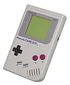
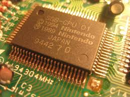
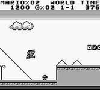

Title: GBakeBoy Emulator
Date: 2018-5-11 12:42
Tags: thats, awesome, ML
Category: yeah
Slug: GBakeBoy

Inspired by various videos of a computer playing game I wanted to see if I could create one for myself.  
Keeping things simple the goal would be: 
### _Goal: Create a system that learns to play super mario on the gameboy_  

This would need a couple of things  

* A gameboy emulator (with an api).  
* A vague understanding of asm.  
* An understanding of deep reinforcement learning (RL).  
* Something to bridge the emulator and RL.  

# Step 1. Build a gameboy emulator

How hard can it be? super hard!

[GBakeBoy code on github](https://github.com/garybake/gbakeboy)

There are plenty of resources on the internet and a lot of people have succesfully built one.
I started over xmas. It would be in python because thats what I know and what the RL would be using.

Thankfully the gameboy is a fairly simple machine. It just fetches and executes single instructions on a single core.
All of the hardware is memory mapped which also keeps it simple.

The initial goal was to get it to _boot the bios_. Once games start to load you have timings and interupts and screen syncs to think about.
The bios sets up some hardware and initialises parts of the memory (also an impressive twist at the end to hide itself).

I got the basic memory map setup and watched as it fetched and executed its first instruction.  
Yey! it's alive! The von Neumann architecture is validated.

Then it was just a case of abstracting out the memory devices and adding more instructions to the interpreter.
It stopped whenever it found a new instruction and I'd add a function in the code for it.

The stack handling was working ok and then I got stuck. The wrong thing was on the stack and I couldn't figure out why.
I tried various things but couldn't get it working.

Sometime later I read that it could take up to a year to build a working emulator.
It was at this point I put a pause on gbakeboy development and found an existing python based gameboy emulator. 
Though I hope to pick this up again at some point as I found it fairly interesting.  

Links I found helpful:

* https://github.com/Baekalfen/PyBoy/raw/master/PyBoy.pdf  
* https://github.com/Dooskington/GameLad/wiki  
* http://www.pastraiser.com/cpu/gameboy/gameboy_opcodes.html  
* emudev.slack.com  

More TODO:

* Main TODO - finish the bios boot.  
* Clean up the opcodes, there is a lot of reduncancy in there.  
* Add/fix the tests.  

