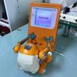
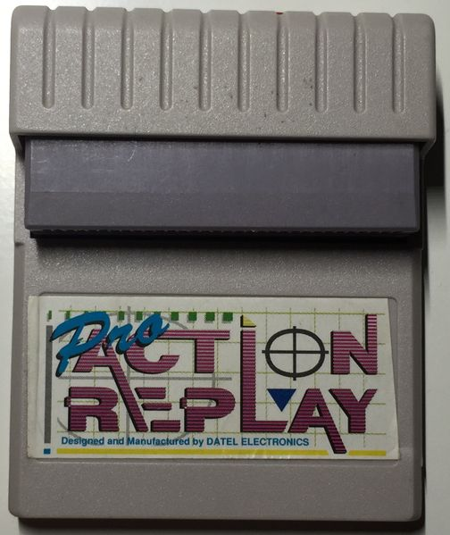

Title: Mario Environmental
Date: 2018-5-16 22:25
Tags: thats, awesome, ML
Category: yeah
Slug: mario-environmental

# Step 2. Explore the mario environment

This is were things get exciting.
I found a really well documented, well written, python based gameboy emulator - [PyBoy](https://github.com/Baekalfen/PyBoy)

I fired it up and all of the games I tried worked perfectly.

Next step is to have a play with its api. There is a good example of [automating tetris](https://github.com/Baekalfen/PyBoy/blob/master/Source/tetris_bot.py)



First thing is to create a PyBoy instance to interact with and load a rom file.
Then we can send key presses on certain frames.

```python
scale = 1
bootROM = None
filename = 'ROMS/mario.gb'
pyboy = PyBoy(Window(scale=scale), filename, bootROM)

for frame in range(500):
    print('frame: {}'.format(frame))

    if frame == 144:
        pyboy.sendInput([WindowEvent.PressButtonStart])
    elif frame == 145:
        pyboy.sendInput([WindowEvent.ReleaseButtonStart])
    elif frame == 152:
        pyboy.sendInput([WindowEvent.PressButtonA])
    elif frame == 153:
        pyboy.sendInput([WindowEvent.ReleaseButtonA])
    elif frame == 156:
        pyboy.sendInput([WindowEvent.PressButtonA])
```

Sweet, we can now play mario without manual effort.

We are effectively playing blind though, it would help our controller if it got some feedback.

There are a number of sprites in the game and you get a reference to them by an index

```python
sprite = pyboy.getSprite(3)
x = sprite.get_x()
y = sprite.get_y()
tile = sprite.get_tile()
```

The x coordinate only says where mario is horizontally on the physical screen which is pretty much always around the centre, rather than where mario is on the level as a whole.
We can use the y coordinate to see how high mario is, and even if we are jumping/falling if we compare this to previous y values.

After some trial and error (and many print lines) I could determine when mario had sadly passed away.

```python
pyboy.getSprite(3).is_on_screen():
    game_over = True
```

### Action Replay

I had an action replay (AR) when I was younger. It had a really cool thing where you could generate your own cheats.
We can use this same method to find pretty much any (volatile) information from a game.



For example to get infinite lives in a game with the AR the steps are:  
(Abridged from vague memories)

1. You have 4 lives.
2. Pause the game and enter the number 4 in the AR.
3. The AR creates a list of all memory locations that have the value 4
4. Un pause the game and loose a life, so you have 3 lives.
5. Pause and enter the number 3 in the AR.
6. The AR filters the previous list to those memory locations that now have the value 3
7. and so on with 2 and maybe 1 lives until you have one or maybe a couple of possible memory locations, say 0x123.
8. You then use this memory location as a cheat code.
9. Whenever the gameboy reads memory location 0x123 the AR intercepts it and returns 4.
10. Tada! Inifinite lives.

 It also did some really cool things where if you didn't now the exact number you could say the next value is 50% of the previous value. Though this is thankfully something I haven't needed to do yet.

 This is where I forked the PyBoy repo because I needed to add my own code to return lists of memory locations.  
 [My fork of PyBoy](https://github.com/garybake/PyBoy)

```python
def get_mem_array(self, mem_locs=None, bits=8):
    """
    Returns a dict of values
    {mem_loc: mem_value}
    Can filter mem_locs by pasting in an array of mem_locs
    """
    mem_vals = {}
    if mem_locs:
        if bits == 8:
            for addr in mem_locs:
                mem_vals[addr] = self[addr]
        else:
            for addr in mem_locs:
                mem_vals[addr] = self.read_word(addr)
    else:
        if bits == 8:
            for addr in range(0xFFFF):
                mem_vals[addr] = self[addr]
        else:
            for addr in range(0xFFFF):
                mem_vals[addr] = self.read_word(addr)

    return mem_vals

```

The actual test runner is handling the filtering. Here I'm just saying give me the values from memory. Initially this is all the values and then smaller and smaller sets. Looking for marios virtual x coordinate I just needed to keep running right and look for a value that was increasing.
I struggled with it at first until I realised it was stored as a 16 bit value =)

I now know where mario is and as a bonus can derive his horizontal velocity. If you need it, it's stored in location 0xc0aa

Sweet!

In their [famous paper](https://deepmind.com/research/publications/playing-atari-deep-reinforcement-learning/) Deepmind learned to play atari games just by watching the screen. We should extract some screen into our controller.

### Screen data attempt 1

The first attempt was using the sdl2 game windows dump() function. This saves a bmp file to the drive.
We could save the file temporarly to the ram drive ('/dev/shm') for speed and then read and stream the data.
This was understandably slow and I couldn't find another way of getting the data straight from the pysdl2 libraries.

### Screen data attempt 2

The game boy screen has a resolution of 160 x 144 x 1 (4 greens + blank)
This must be held somewhere before pysdl2 renders it. At first I imagined there would be a nice block of RAM I could read from where the screen array was nicely organised - nope. 

Looking into how the GameWindow actually built the screen you can see that there is a pipeline that renders it all to a screen buffer. The buffer is then rendered neatly to the screen in one go. I just needed to extract this buffer.

```python
def get_screen(self):
    """
    Returns current screen
    :return 2 dimensional array 
    """
    buffer = self.pyboy.window._screenBuffer._array

    return buffer.tolist()
```

I've lost the code I used but it used the pillow library to convert this array into a bmp image and verify the array was what I expected.

Thats should give us enough information about the environment to be able to train Mario.

Next: Make a clean environment api