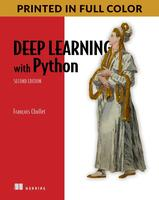

Title: mario learning
Date: 2018-5-27 23:21
Tags: thats, awesome
Category: yeah
Slug: mario-learning

# Step 4. Reinforcement Learning - Q-Learning

Now we have everything set up and the basic random policy. Mario would have to be super lucky to get anywhere with this.
It's time to improve the policy.


I'm going to use the reinforcement learning technique of deep Q-learning.

## Deep Q-Learning

This is the algorithm [deepmind](http://arxiv.org/abs/1312.5602) used when learning to play atari games.
There are a few concepts we need to go over first.

### Markov Decision Process

This is a topic in itself. For more detail see [here](https://leonardoaraujosantos.gitbooks.io/artificial-inteligence/content/markov_decision_process.html).  
Basically it means we can transition around states using actions. For the algorithm to work we need an interesting property to hold, the Markov property.

> The probability of the next state s<sub>i+1</sub> depends only on current state s<sub>i</sub> and performed action a<sub>i</sub>, but not on preceding states or actions.

This essentialy means that to calculate the next state we only need to know the current state and action. How we got to this state we can ignore.  


### Discounted Future Reward

How do we know how good the current state is? we can add up all of the future rewards.
How much do rewards in the present count over rewards in the future?  We can add a discount factor, such that present values aren't discounted much and those in the future are discounted heavily (up to a point where it discounts the reward to zero in the further future). This constrains the future reward calculation also handles the uncertainty that future actions bring.


> R<sub>t</sub> = r<sub>t</sub> + γ(r<sub>t+1</sub> + γ(r<sub>t+2</sub> + …)) = r<sub>t</sub>+γR<sub>t+1</sub>


γ is the discount factor ranging from 0 to 1. 0 means we only consider the next step. 1 means actions in the far future have equal weight to those on the next step.


### Exploitation vs Exploration (ϵ-greedy)

As an example we go to one restaurant and we really like the food. Next time we can go to the same restaurant where we know the food is nice, or we can go to another restaurant and run the risk the food being poor or even better than the first. This is the basic idea of, do we have the agent do the best action each time (greedy approach) or do we have it explore new avenues that initially look worse but could lead to better long term rewards.

The greedy route will often lead to a sub optimal solution. The random approach means the agent may be learning but it is never applying the learning.

The common strategy here is called the ϵ-greedy approach.
At the start the agent picks random actions (explore) as we know little about the environment. As it starts to learn we reduce the chance of random actions and increase the chances of learned actions (exploit). Later on the agent reaches a point where it's mostly doing learned actions. We can stop reducing the random choice odds from now on. (We still want some exploration).


In the implementation we transition through 3 states  
Explore -> Reducing Epsilon -> Static Epsilon

```python
OBSERVE = 50
INITIAL_EPSILON = 0.1
FINAL_EPSILON = 0.0001  # final value of epsilon
EXPLORE = 3000
```

```python
if random.random() <= epsilon:
    # Random Action
    action_index = random.randrange(NUM_ACTIONS)
    action[action_index] = 1
else:
    # Learned action
    q = model.predict(state_stack)
    ...

# We reduced the epsilon gradually
if epsilon > FINAL_EPSILON and tick > OBSERVE:
    epsilon -= (INITIAL_EPSILON - FINAL_EPSILON) / EXPLORE
```

### Q function

The discounted reward function above can be reduced to what is known as the Bellman equation. The reward the agent recieves is equal to the current reward plus the maximum of the reward at the next step. 

> Q(s,a) = r + γ maxQ(s<sub>t+1</sub>, a<sub>t+1</sub>)

The idea behind q-learning is taht we can iterativel approximate Q

> Q<sub>t+1</sub>(s<sub>t</sub>,a<sub>t</sub>) = Q<sub>t</sub>(s<sub>t</sub>,a<sub>t</sub>) + α(r<sub>t+1</sub> + γ maxQ<sub>t</sub>(s<sub>t+1</sub>, a) - Q<sub>t</sub>(s<sub>t</sub>, a<sub>t</sub>))

α is the learning rate. One of the hyperperameters that will need tuning

Neural networks are also know as universal function approximaters which we can use here to approximate q. Hence the deep part of deep reinforcement learning.

```python
q = model.predict(state_stack)
max_Q = np.argmax(q)
action[max_Q] = 1
```

### Convolutional Neural Network model

The agents view of the world is a in a gray (green?) scale image. We need to stack 4 of them on top of each to help the learning process gauge marios direction and velocity. If we just used a single frame the model wouldn't be able to tell if mario was falling or jumping.
(TODO - the learning stack size should be a hyperparameter)

We store these stacks in a big cache called the replay memory. This is one of the parts I thought was pretty innivative.
On each tick the agent doesn't run a learning cycle on the last action, it runs it on a random action from the past. If we only picked the last action then the known reward would only be from the last action taken. By picking a random action from the past we can get a decent calculation of the future reward from that action by traversing the future of that action in the cache.

The model

We use a [convolutional network](https://medium.freecodecamp.org/an-intuitive-guide-to-convolutional-neural-networks-260c2de0a050) given our imput is images. After the convolution layers we flatten the data and pass it through a standard dense layer. The final output has 3 nodes, with each node containing the predicted weighting of each action (left, none, right). 


```python
def buildmodel():
    # Adapted from https://yanpanlau.github.io/2016/07/10/FlappyBird-Keras.html
    print("Building the model ")

    model = Sequential()
    model.add(layers.Convolution2D(
        32, 8, 8, subsample=(4, 4), border_mode='same',
        input_shape=(IMG_ROWS, IMG_COLS, IMG_CHANNELS)))
    model.add(layers.Activation('relu'))
    model.add(layers.Convolution2D(
        64, 4, 4, subsample=(2, 2), border_mode='same'))
    model.add(layers.Activation('relu'))
    model.add(layers.Convolution2D(
        64, 3, 3, subsample=(1, 1), border_mode='same'))
    model.add(layers.Activation('relu'))
    model.add(layers.Flatten())
    model.add(layers.Dense(512))
    model.add(layers.Activation('relu'))
    model.add(layers.Dense(3))

    adam = Adam(lr=1e-6)
    model.compile(
        loss='mse',
        optimizer=adam)
    print("We finish building the model")
    return model
```

### Running

Putting it all together and we can kick of some learning, woohoo!

There is a script in the [repo](https://github.com/garybake/PyBoy) called run_mario_test.sh that launches the client and server in parallel.  


<iframe width="560" height="315" src="https://www.youtube.com/embed/1NzQAoZR-E0" frameborder="0" allow="autoplay; encrypted-media" allowfullscreen></iframe>


### Tuning

This is the part where we would tune the model (both the network and the Q-learning parameters).
Unfortunately I'm running this on a laptop without a graphics card for accelerated learning. You can see on the video each step is really slow.
It starts slowish on the exploration phase and then slows right down when it starts learning. I'm not going to get enough cycles to even start tuning the network.

### TODO

Phew, this is where I'm currently up to with it. There is more todo, primarily around speeding up the steps.
I think I need to run this on an aws instance with a decent gpu, but this means getting it running it headless but still rendering enough.
There is still plenty of fat to trim in the whole process.


### A third way?
Whilst writing this post Open AI [announced](https://blog.openai.com/gym-retro/) support for more consoles, including gameboy, happy days!  
[repo](https://github.com/openai/retro/tree/develop)  

Maybe there will Step 5 if I can get it working

### Shoutout

Finally a shoutout to a book that has been really helpful for me learning deep learning. It's written by the author of the keras library, and it's really approchable and understandable. I can't reccomend it enough.

[Deep Learning with python by François Chollet](https://www.manning.com/books/deep-learning-with-python)


