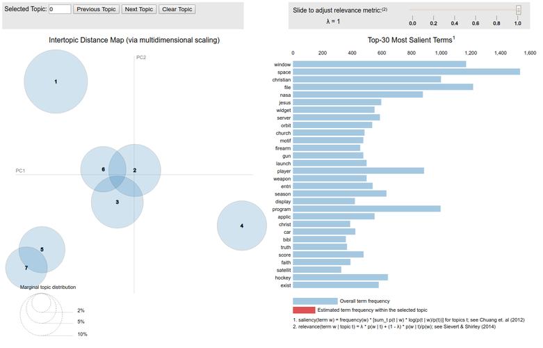

Title: NLP Topic Modelling
Date: 2019-1-19 09:25
Tags: NLP, ML, Topic_Modelling
Category: ML
Slug: nlp-topic-modelling

# Topic Modelling

One of my resolutions was to start adding to the site. Sometimes I spend time learning something and it gets lost and may interest others if I shared it.

I went to the Manchester PyData meetup in November and a guy did a really interesting talk on topic modelling. It was something I had played with a long time ago when doing call centre analytics. I had also been reading through the "Text analytics with Python" book over xmas and decided it was time to build something.

If you are interested in looking into NLP (Natural Language Processing) then I highly recomend this book.

You can view the rendered jupyter content [here](https://nbviewer.jupyter.org/github/garybake/nlp_modelling/blob/master/LDA_study.ipynb) (or link straight the the github repo [here](https://github.com/garybake/nlp_modelling/blob/master/LDA_study.ipynb))

It was a fun project, and nice to do some unsupervised learning for a change, especially with NLP.

Hopefully in the future I will have time to follow up this post with some of the things from the conclusion part of the doc.
